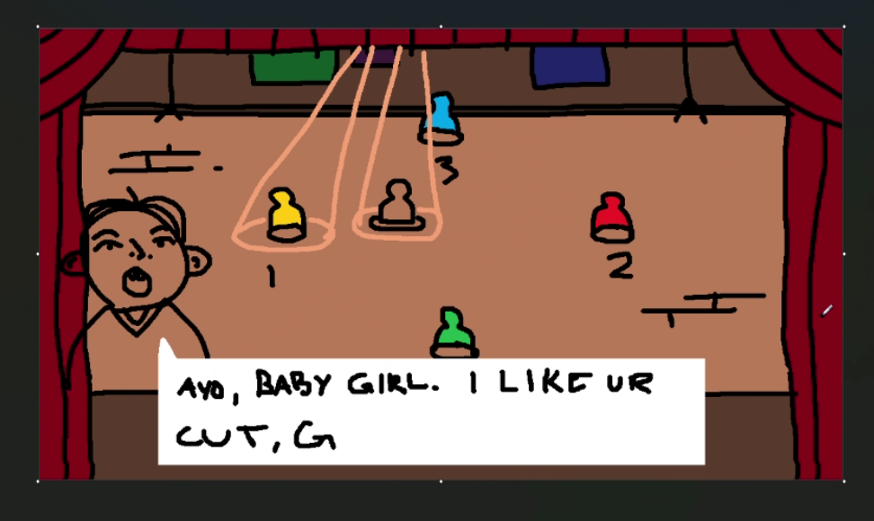

# Got Rizz

**Got Rizz** is a browser-based multiplayer social AI game powered by **MCP (Model Context Protocol)**.



## Game Overview

**Got Rizz** is a 2–4 player social AI party game where players compete in real time to win over the affection of the **AI girl** in the center of the scene.

Each player takes turns trying to “rizz” (charm or flirt with) her through clever dialogue.  
She **remembers** what you say, **responds dynamically**, and **moves toward** the player she feels the strongest connection with.  
When she reaches a player, that player **wins**.

Passive spectators can observe, and everyone can chat in the off-game Chatroom.

### Gameplay Loop

1. Players take turns sending messages to the girl.  
2. The girl replies using her own AI-generated logic, remembering context and past interactions.  
3. Based on her perception (emotion, tone, and memory), she moves closer to the player she’s most interested in.  
4. When she reaches a player, that player wins.  

A mix of **humor**, **charm**, and **emergent AI personality** ensures that **no two games are ever the same**.

---

## Project Setup

### Installation

Clone the repository, duplicate `.env.example` as `.env` (and fill custom variables if want), and then type:

```bash
npm install
npm run start
```

---

## Technical Architecture

### GameMaker - HTML Iframe

- Handles **graphics**, **animation**, and **input**.
- Displays the girl and player avatars in a dynamic scene.
- Connects to a Node.js backend via **WebSocket** for real-time multiplayer updates.

**Listens for:**

- Players connected
- Girl’s position updates
- Dialogue and chat messages from girl

**Sends:**

- Player join (name)
- Player messages

---

### Webpage Integration — React + GameMaker Bridge

The **GameMaker HTML5 export** runs inside an **iframe**, which is **wrapped and managed by a React frontend**.  
This setup allows the game to blend traditional **GameMaker rendering** with modern **responsive web design** and **interactive GUI components**.
For example, the React frontend can display and handle the Chatroom, using the same player data that GameMaker uses.

---
#### Responsibilities

**React Layer**

- Provides the **webpage structure** and **responsive GUI** (menus, overlays, chatroom, ads, layout, etc.).  
- Hosts the **GameMaker canvas** inside an `<iframe>` component.  
- Listens to and emits messages through **WebSocket** to synchronize state with the backend/GameMaker.  

**GameMaker Layer**

- Handles **game visuals**, **animations**, **sounds**, etc.  
- Exposes **JavaScript functions** (like `gmcallback_*`) that React can call directly for **real-time in game updates**.  


---
#### Communication Bridge

**WebSocket (shared channel)**  

- Used for **multiplayer synchronization** between **React**, **GameMaker**, and the **Node.js** backend.  
- Keeps all clients (players) updated on **chat**, **turns**, and **game state**.  

**Direct JS Calls**

- React can trigger GameMaker events using functions such as  
  `window.gml_Script_gmcallback_handleSocketClosed()` or similar callbacks defined in the HTML5 export.  


Together, these layers create a **hybrid architecture** where **React** manages the **outer experience** and **GameMaker** delivers the **core gameplay**, allowing a seamless, visually rich, and adaptive web experience.

---

### Backend — Node.js Authoritarive WebSocket Server

- Manages **player sessions** and **real-time game state**.
- Handles:
  - Player connections/disconnections
  - Message history
  - Rooms/Girl/Players states
  - Input sanitization
  - Turn sequencing
    --Passes websocket messages to GameMaker client/React regularly to sync clients
- Communicates with the **MCP server** for AI-driven decision-making.

---

### MCP Client/Server — LLM Logic Core

Powered by **Model Context Protocol (MCP)** for advanced contextual reasoning.

**Responsibilities:**

- The girl’s dialogue generation
- Attraction scoring to determine who she moves toward
- Deciding who to move towards that turn

Returns structured data back to Node.js, for example:

```json
{
  "responseText": "You seem really sweet when you talk like that.",
  "emotion": 1,
  "player": "tim",
}
```

- This data is then processed into the backend GameState, and sent back out to the frontend.

---

## Developer Note

This is **Tabor and Salem Holly’s first test** combining **MCP**, **LLMs**, and **gaming** —  
an early experiment exploring how large language models can power dynamic, emotional, and adaptive gaming experiences.
